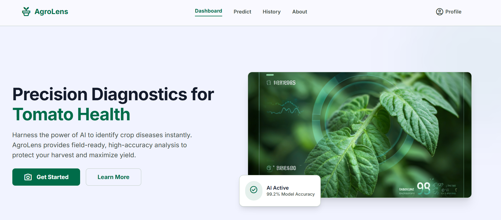
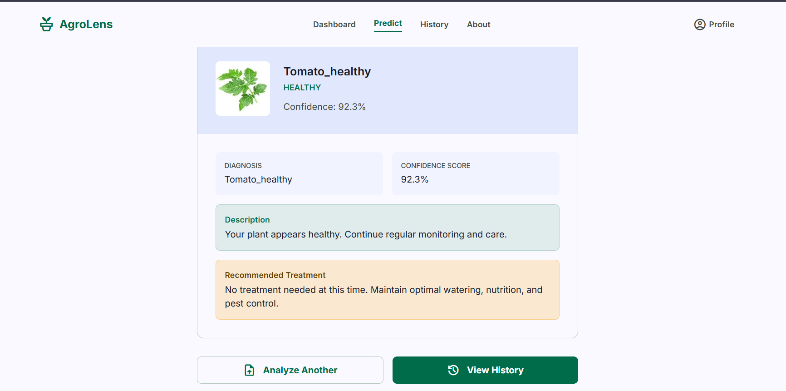
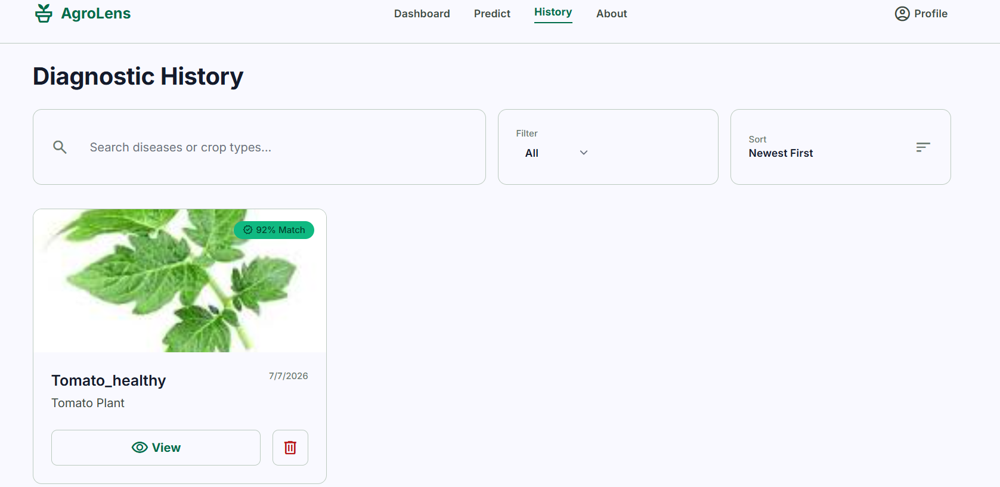

# 🍅 AgroLens: Plant Disease Predictor

[](https://plant-disease-frontend-r4s5.onrender.com/)
[]()
[]()
[]()

AgroLens is an AI-powered web application that helps farmers and gardeners identify tomato plant diseases instantly from images. By leveraging a deep learning model built with PyTorch, it provides accurate predictions, confidence scores, and actionable treatment recommendations.

**[🌐 Live Demo: AgroLens](https://plant-disease-frontend-r4s5.onrender.com/)**

---

## ✨ Features

- **Instant Disease Detection**: Upload a photo of a tomato leaf and get immediate results.
- **Detailed Insights**: View confidence levels and top 3 possible predictions.
- **Treatment Recommendations**: Get actionable advice on how to treat the identified disease.
- **Prediction History**: Keep track of all your past scans and monitor plant health over time.
- **Secure Authentication**: Personal accounts to save and manage your prediction history securely.

---

## 📸 Screenshots

### 🏠 Home Page
The welcoming landing page where users can learn about the application and start diagnosing.



### 🔍 Prediction Interface
An intuitive interface to upload leaf images and view the AI's diagnostic results and treatment advice.



### 📊 History Dashboard
A comprehensive dashboard showing your past scans, overall plant health statistics, and recent activity.



---

## 🛠️ Technology Stack

### Frontend
- **React.js**: For building a dynamic and responsive user interface.
- **Tailwind CSS**: For modern, clean, and responsive styling.
- **Axios**: For handling API requests securely.

### Backend
- **FastAPI**: A modern, fast web framework for building APIs with Python.
- **PyTorch & Torchvision**: For loading and running inference on the custom trained Modified GoogLeNet model.
- **MongoDB**: NoSQL database for storing user profiles and prediction history.
- **Cloudinary**: For secure cloud storage of uploaded images.
- **JWT**: For secure, token-based user authentication.

---

## 🚀 Local Setup & Installation

### Prerequisites
- Python 3.11+
- Node.js & npm
- MongoDB (Local or Atlas)

### 1. Clone the repository
```bash
git clone https://github.com/Dhairyatiwari7/Plant-disease-predictor.git
cd Plant-disease-predictor
```

### 2. Backend Setup
```bash
cd backend
python -m venv venv
source venv/bin/activate  # On Windows use: venv\Scripts\activate
pip install -r requirements.txt
```
Create a `.env` file in the `backend` folder:
```env
MONGODB_URL=your_mongodb_connection_string
SECRET_KEY=your_jwt_secret_key
CLOUDINARY_CLOUD_NAME=your_cloudinary_name
CLOUDINARY_API_KEY=your_cloudinary_key
CLOUDINARY_API_SECRET=your_cloudinary_secret
ALLOWED_ORIGINS=http://localhost:3000
```
Start the backend server:
```bash
uvicorn main:app --reload
```

### 3. Frontend Setup
```bash
cd ../frontend
npm install
```
Create a `.env` file in the `frontend` folder:
```env
REACT_APP_API_URL=http://localhost:8000
```
Start the development server:
```bash
npm start
```

---

## 🧠 The AI Model

The application uses a custom-trained **Modified GoogLeNet** architecture implemented in PyTorch. It has been trained on a comprehensive dataset of tomato leaves to accurately classify the following conditions:
- Bacterial Spot
- Early Blight
- Late Blight
- Leaf Mold
- Healthy

---

## 👨‍💻 Developer

**Dhairyatiwari7**
- GitHub: [@Dhairyatiwari7](https://github.com/Dhairyatiwari7)
